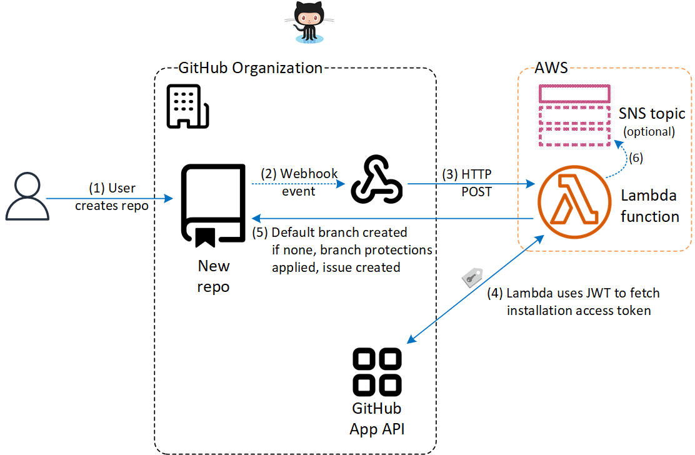

# Branch Protector GitHub App for AWS Lambda in .NET 6

A solution for automating the protection of the default branch in newly-created GitHub repos. The solution is built in .NET 6 and configured to run in an AWS Lambda function using the Lambda Function URL feature to expose it over HTTP.

### This readme file will contain the documentation and instructions for deploying the solution

**Content TBD**

## Background
Over time, organizations often find they create an increasing number of code repos in GitHub. Manual processes to enforce quality controls, such as ensuring code is reviewed prior to being merged into the main branch, can fail to keep up. Fortunately, GitHub apps can be used to automate this process. This solution implements a GitHub app that automatically applies branch protection rules to the default branch in newly-created repos. If the new repo was created without a default branch, the solution will create the default branch (using the branchname configured as default for the GitHub organization) in the repo by creating a README file in the root of the repo.

**The solution consists of:**

 + [GitHub App](https://docs.github.com/en/developers/apps/getting-started-with-apps/about-apps).  GitHub Apps are the officially recommended way to integrate with GitHub.
 + [AWS Lambda function](https://aws.amazon.com/lambda/) written in C# for .NET 6
   + The project uses the [Octokit GitHub API Client Library for .NET](https://github.com/octokit/octokit.net)
   + [The Lambda Function URL](https://docs.aws.amazon.com/lambda/latest/dg/lambda-urls.html) feature is used to avoid the need to set up an Amazon API Gateway. Lambda Function URLs were introduced in April 2022

The following sections show a high-level diagram of the solution, and then details on how to implement each of the above items. **This is a proof of concept - do not put this solution into production unless/until you review and understand all aspects of what it's doing**.

## Solution Overview

### GitHub App

### AWS Lambda function

## How to implement the solution

_Note: you will deploy the .NET 6 project to AWS Lambda before creating the Github App because the Lambda function's URL is needed when configuring the GitHub App._

### Deploy the .NET 6 application to AWS Lambda

TBD

### Create and install the GitHub App

### Create and register a new GitHub App

Follow the steps in the GitHub docs for [Creating a GitHub App](https://docs.github.com/en/developers/apps/building-github-apps/creating-a-github-app). As you get to each of the steps below, follow the instructions for that step:

**Step 7**. For your app's website URL, you could use the URL of the repo containing your fork/copy of this code, or an intranet site with documentaion for your implementation of this solution.

**Step 8**. Leave the callback URL blank.

**Steps 9 - 12**. Skip steps 9 through 12

**Step 13.** Paste your Lambda function URL from the previous section into the Webhook URL field.

**Step 14**. Enter in a secret for your webhook. Follow the guidance in the GitHub docs for [Securing your webhooks](https://docs.github.com/en/developers/webhooks-and-events/webhooks/securing-your-webhooks) to choose a secret.  **Store your secret somewhere secure and never share it - you will need it to configure your AWS Lambda**.

**Step 15**. For repository permissions, select `read and write` for 'Administration', 'Contents' and 'Issues'. Select `read-only` for 'Metadata'. 

**Step 16**. Under 'Subscribe to events', select `Repository`.

You have now created and registered your GitHub app. Next, you'll need to install it for your organization.

### Install the GitHub App for your organization

TBD

### Configure Lambda function environment variables

TBD